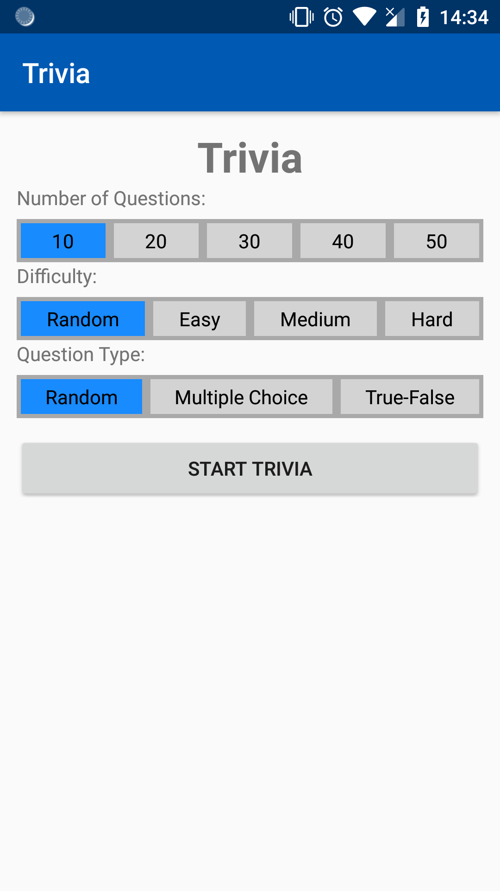
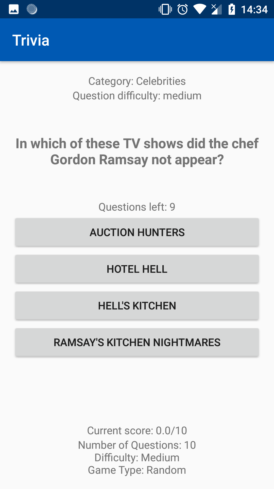
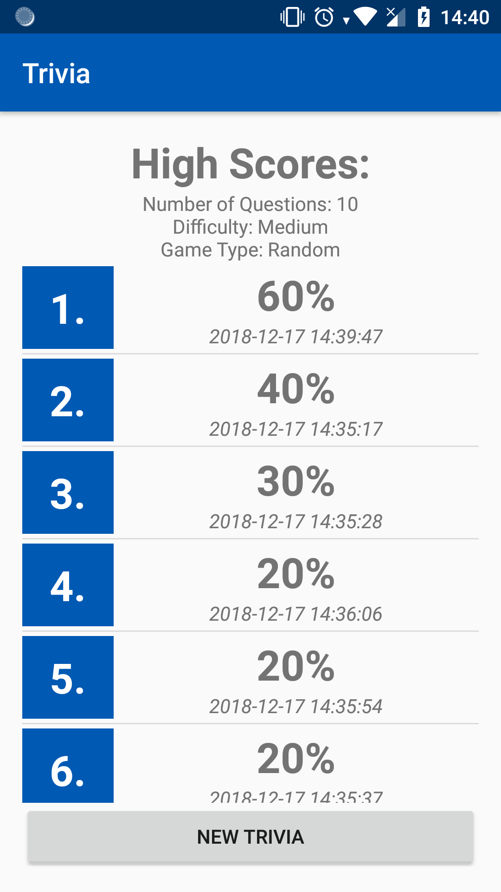
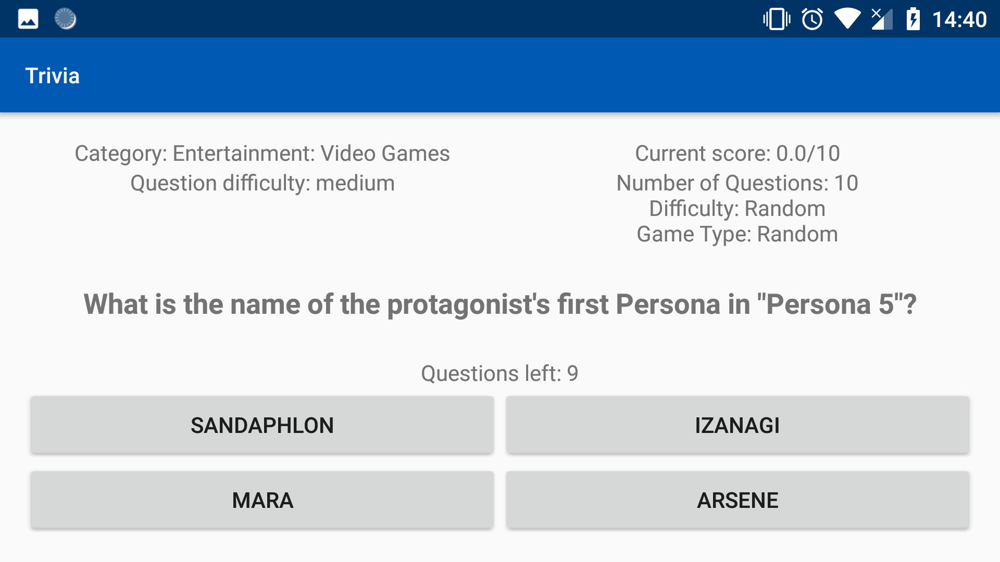

# Trivia

## Author info
**Name:** Stefan Klut  
**Studentnumber:** 11331720  
**email:** stefanklut12@gmail.com

## Description
An app where you can play a trivia game. The questions for this trivia game come from the Open Trivia Database API.
On the opening menu the user has the option to choose the game options that are send to the API to recieve a certain kind of question.
After selecting the options and starting the game the questions are retrieve from the API and loaded into the game.
While playing the game the answers are displayed on buttons to click on. 
If the button that was clicked was the correct answer the score is increased. 
Once the game has finished the highscore gets posted to a website, where the highscore is added.
For all combinations of game options there is a list with highscores on this website.
After this is done all the highscores are retrieved from this website with the appropriate game options, and they displayed to the user.

## Screenshots

### Categories selection:

### Menu item selection:

### Displayed menu item:

### Landscape mode:

